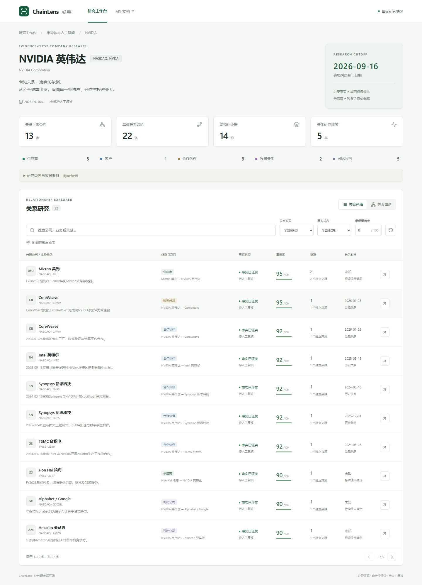

# ChainLens · 链鉴

基于公开证据的 NVIDIA 供应链与合作关系研究工作台。把“公司之间是什么关系”拆成可追溯的具体结论、方向、时间、证据和确定性评分，适合展示后端建模、React 数据流与全栈测试。

**研究信息截止日：2026-09-16。** 固定快照包含 NVIDIA 加 13 家关联上市公司、22 条关系、14 份证据，覆盖五类角色。它是精选研究样本，不是完整市场覆盖。历史公告不自动证明当前合作或持股，22条关系已由 JOE 于2026-09-22完成人工审核（`approved`），默认数据集为`2026-09-16.v3`。分数不是投资价值或统计概率，本项目不构成投资建议。



## 功能与技术

- 中文研究工作台：公司概览、五类关系、共享筛选的表格与交互关系图、关系详情、证据原文定位与评分分项。
- Python 3.12 / FastAPI / Pydantic 2 / SQLAlchemy 2 / SQLite，Typer CLI 与 API 共用业务服务。
- React 19 / TypeScript / Vite / React Flow；Vitest + Testing Library 组件测试，Playwright 真实后端浏览器测试。
- 版本化 JSON 快照、摘录及文件 SHA-256、幂等导入。安装完成后，默认查询和测试不需要互联网、AI 密钥或付费服务。

## 安装与启动

需要 Python **3.12 或 3.13**、[uv](https://docs.astral.sh/uv/getting-started/installation/)、Node.js **22.12+**（本机验证使用 24）、pnpm **11.19.0**。准确依赖由 `uv.lock` 与 `frontend/pnpm-lock.yaml` 固定。以下命令在仓库根目录执行。

```sh
uv sync --frozen
uv run chainlens import-snapshot
pnpm --dir frontend install --frozen-lockfile
```

分别打开两个终端：

```sh
# 终端一：API
uv run uvicorn app.main:app --host 127.0.0.1 --port 8000
```

```sh
# 终端二：网页
pnpm --dir frontend dev
```

打开 [研究工作台](http://127.0.0.1:5173)、[API 文档](http://127.0.0.1:8000/docs)。默认数据库是仓库下 `data/chainlens.sqlite3`，自动创建；显式导入命令适合在启动前发现快照错误。首次启动也会载入默认快照。

当前 Windows 开发环境的 pnpm 不在 PATH，可用 `./scripts/frontend.ps1 install`、`./scripts/frontend.ps1 dev` 等命令；脚本先查 PATH，再查本机已有 Codex 运行时。正常安装 pnpm 的电脑直接使用上述跨平台命令。

可选环境变量见 `.env.example`，只有示例，无凭据。程序直接读取进程环境，**不会自动加载 `.env`**。设置自定义数据库示例：PowerShell 使用 `$env:CHAINLENS_DATABASE_URL='sqlite:///./.runtime/demo.sqlite3'`，POSIX shell 使用 `export CHAINLENS_DATABASE_URL=sqlite:///./.runtime/demo.sqlite3`。相对数据库 URL 依赖工作目录，建议在根目录运行或使用绝对路径。`CHAINLENS_SNAPSHOT` 指定空数据库的初始化文件；已有数据库继续使用已导入版本，切换须运行 `uv run chainlens import-snapshot --path NEW.json`。

端口冲突时先停止占用端口的旧开发服务，或同步调整 Vite 的代理与 API 端口。前端生产静态构建为 `frontend/dist`；部署时配置 `/api` 反向代理，本项目不包含生产托管。

## 查询示例

```sh
curl http://127.0.0.1:8000/api/health
curl "http://127.0.0.1:8000/api/companies?q=NVIDIA&page=1&page_size=20"
curl http://127.0.0.1:8000/api/companies/nvidia
curl "http://127.0.0.1:8000/api/companies/nvidia/relationships?relationship_type=supplier&min_confidence=60&sort=confidence_desc"
curl "http://127.0.0.1:8000/api/companies/nvidia/graph?fact_status=confirmed"
uv run chainlens companies --json
uv run chainlens company nvidia --json
uv run chainlens relationships nvidia --json
uv run chainlens graph nvidia --json
```

从返回关系中取得 `id`，即可查询 `GET /api/relationships/{id}`、`GET /api/relationships/{id}/evidence`，或 `uv run chainlens evidence RELATIONSHIP_ID --json`。完整参数用 `uv run chainlens relationships --help` 查看，HTTP 参数见 `/docs` 和 [API 契约](docs/contract.md)。

列表支持关键词、相对关系角色、最低置信度、事实状态、日期、稳定排序与分页（单页最多 100）。图沿用筛选，最多展示前 100 条并显式返回截断信息。`known_at` 按当时已发表的证据子集重评分；`valid_at` 按有效区间筛选。未知时间默认不纳入有效日过滤，`include_unknown_time=true` 可纳入不确定候选，仍不视为已知。不能查询晚于研究截止日的日期。

## 测试与复现

后端采用 `backend/app` 分层结构，路由、模型、校验、业务服务、配置和数据库访问各自独立。目录职责与运行说明见 [后端开发说明](backend/README.md)。旧环境更新后请先运行 `uv sync --frozen`，HTTP 入口为 `app.main:app`，CLI 命令仍为 `chainlens`。

```sh
uv run pytest
uv run ruff check backend
uv run python scripts/snapshots.py verify --manifest data/snapshots/manifest.json
pnpm --dir frontend typecheck
pnpm --dir frontend test
pnpm --dir frontend build
# 浏览器首次安装需要联网，之后核心流程只请求本地服务
pnpm --dir frontend exec playwright install chromium
pnpm --dir frontend e2e
```

测试使用隔离的合成 fixture 覆盖冲突、未知日期、转载等边界，真实快照测试覆盖研究数据结构及五类角色。浏览器核心流程连接真实后端和固定快照。实际执行结果和未通过检查见 [验收记录](docs/acceptance.md)。

浏览器测试会自动启动独立端口 **8001/5174** 的后端/前端，使用 `.runtime/e2e-v3.sqlite3`，退出时关闭测试服务。普通开发的8000/5173服务不受影响。Windows 包管理器不可用时可用 `./scripts/frontend.ps1 browser` 与 `./scripts/frontend.ps1 e2e`。

## 资料清单与更新

```sh
uv run python scripts/snapshots.py sources
uv run python scripts/snapshots.py compare data/snapshots/2026-09-16.v1.json data/snapshots/2026-09-16.v1.json
```

在线研究与离线运行分开：按来源清单打开允许访问的原文，核对上下文、实体、日期和摘录，新增版本化快照与 manifest，再校验、比较、导入。旧快照保留，使用独立数据库回溯。项目不自动绕过来源限制，也不自动将新闻共现转成关系。详见 [方法论](docs/methodology.md) 和 [研究日志](docs/research-log.md)。

仓库只保留必要短摘录和解释，不默认分发原始全文。源码适用 [Apache-2.0](LICENSE)，第三方来源材料仍适用原权利人与来源条款；许可未知的资料不能据此取得全文再分发权。

## 阅读与演示

- [数据模型、前后端职责与架构](docs/architecture.md)
- [来源、时间、冲突、去重与评分方法](docs/methodology.md)
- [逐条人工审核记录与整体方法草稿](docs/human-review.md)
- [AI 使用披露与后续事项](docs/ai-usage.md)
- [五分钟面试演示与 React 讲解](docs/interview-guide.md)
- [十项验收映射、验证结果与限制](docs/acceptance.md)