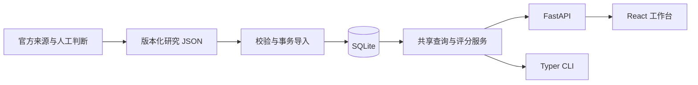

# 架构与关键取舍

ChainLens 是一个本地单体研究工具。SQLite 保存一个已导入的数据集，FastAPI 和 Typer 调用同一套查询与评分逻辑，React 负责展示和交互。默认运行只读本地快照，不连接证券行情、AI 服务或外部来源。

## 数据模型

Company 使用稳定内部 ID，证券代码只作为属性，避免代码变更影响引用。法定名称、别名、交易所、上市状态、母公司 ID 和实体解释共同用于消歧。子公司参与的事实可以映射到上市母公司，但必须写明映射，不能暗示法律交易方必然为母公司。

Relationship 保存具体结论、端点、类型、事实状态、时间、不确定性、人工复核状态。公司对不是唯一键：同一对公司允许供应、合作、投资、同行等不同关系，也允许不同业务事件。

Evidence 保存来源元数据、短摘录和内容校验值。关联表记录每份证据针对每条关系的支持/反驳立场和直接性；因此证据与关系是多对多。转载必须保留同一独立来源标识，不增加独立证据数。

Score 单独保存总分、分项、解释、版本与计算时间。分数衡量特定结论的证据充分程度；是否仍然持续是另外一个字段。历史查询会根据当时已发表的证据子集重新评分，不能直接复用完整快照分数。

## 后端职责

- Pydantic 校验输入、枚举、日期、关联引用和快照完整性。
- SQLAlchemy 管理表、关联、会话与导入事务；SQLite 适合此版本的小规模固定快照。
- 共享服务统一角色转换、时间过滤、排序、分页、证据聚合与评分，避免 CLI 和 API 各自解释同一事实。
- 图复用列表筛选，先稳定排序再限制到 100 条。返回总量、展示数量与截断说明；表格分页不改变图的筛选范围。
- 默认读取固定快照；重复导入不新增重复实体。更新是显式动作，原始版本文件继续保留。

## 前端职责

使用 React + TypeScript + Vite；页面状态和 props 为主。过滤状态由工作台持有并传给筛选区、表格和图，选中的关系 ID 控制统一详情面板。组件没有第二套评分或研究判定规则。

请求以 AbortController 管理取消，防止快速切换筛选时旧响应覆盖新结果。数据加载、网络失败、空列表、无证据和长文本均有独立展示。React Flow 负责图渲染、交互和视口，布局采用现成工具；表格和详情按钮提供键盘可达的替代入口。

开发时浏览器只调用同源 `/api`，由 Vite 转发到 `127.0.0.1:8000`，不需要浏览器持有密钥。生产构建是静态文件；正式部署需要静态服务器及 API 反向代理。本次交付为可运行的本地仓库。

## 有意保留的边界

第一版不加入用户系统、后台编辑器、任务队列和自动信息抽取。事实判断通过可审查的 JSON 变更完成；适合展示证据建模和全栈工程能力，但并非实时证券研究终端。

SQLite 只有当前导入版本，旧版本由仓库快照保留；回溯时向独立数据库导入指定快照，不依赖覆盖后的行重建历史。大规模数据需要数据库迁移、索引策略和更精细的 SQL 聚合，本项目的重点是语义一致和可复现。
